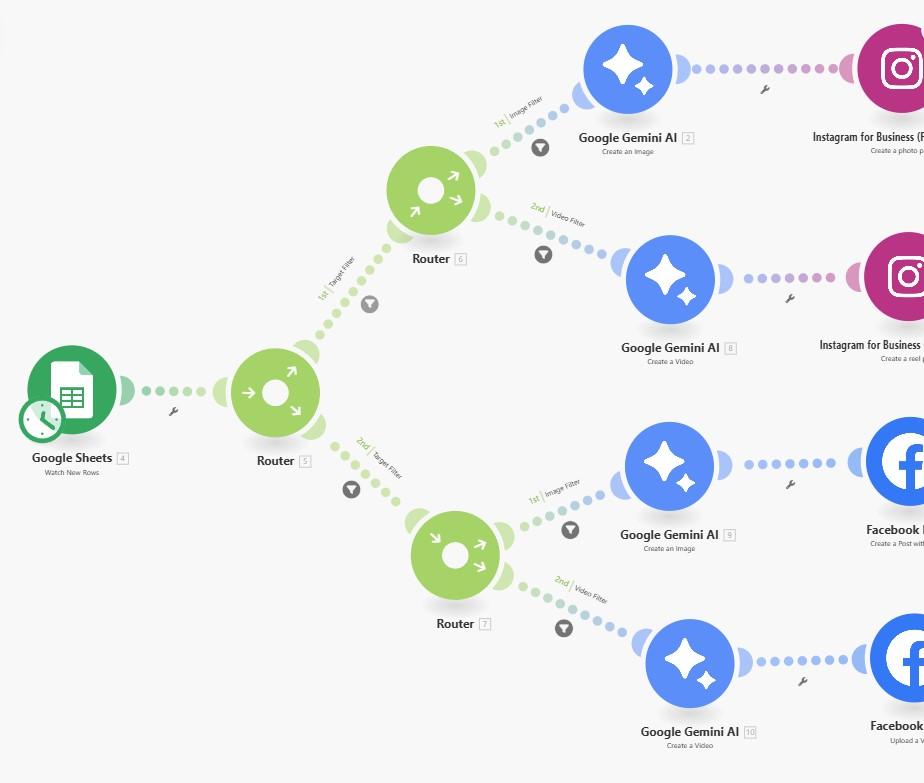

# 📘 Make Scenario: From Google Sheets to IG (Instagram) & FB (Facebook) (Only Image)
This Make.com scenario automates the process of posting AI-generated images to Instagram and Facebook using prompts stored in a Google Sheet.

 

**Organization:** Majestik Magik 

**Author:** Amos0312  

**Email:** amosmiller0312@gmail.com  

  

## 📥 Step 1: Import the Scenario
Go to Make.com.

Navigate to Scenarios > Import.

Upload the provided .blueprint.json file.

Wait for the import to complete and ensure all modules are loaded correctly.

## ⚙️ Step 2: Configure Connections
You’ll need to authenticate and connect the following services:

### 1. Google Sheets
Click the Google Sheets – Watch Rows module.

Set up your Google connection.

Choose or browse to your spreadsheet. The expected structure should begin from A1:Z1 with headers.

### 2. Gemini AI (Image Generation)
Click the Gemini AI – Create an Image modules.

Connect your Gemini AI account or API.

Ensure the model is set to: imagen-3.0-generate-002.

### 3. Instagram for Business
Connect your Instagram Business Account using the module Create Post Photo.

Ensure the connected account has posting permissions and linked to a Facebook Page.

For more detail go to [here](#how-to-configure-instagram)

### 4. Facebook Pages
Connect your Facebook Page in the Create Post With Photos module.

Grant all necessary posting permissions.
For more detail go to [here](#how-to-configure-facebook)

## 📊 Step 3: Google Sheets Format
Ensure your Google Sheet follows this column structure:

A (No)	B (FileType)	C (TokenString/Prompt)	D (TargetMedia: instagram/facebook)	... up to Z

B should be "image" for the scenario to trigger.

D should be either "instagram" or "facebook".

C is the image generation prompt.

## 🔁 Step 4: Automation Logic
Google Sheets module watches for new rows.

A router checks the TargetMedia column:

If instagram → generate image → post to Instagram.

If facebook → generate image → post to Facebook.

Posts are created only if the row’s FileType is "image".

## 🧪 Step 5: Testing
Add a new row in your connected Google Sheet with the proper structure.

Run the scenario manually to ensure everything works.

Review the generated image and social media post.

## 🗓️ Optional: Scheduling
After successful testing, set the Google Sheets Watch Rows module to run periodically (e.g., every 15 minutes).

## 🛠️ Troubleshooting Tips
Ensure each module is fully connected and authorized.

Check if the Instagram account is a Business Account linked to a Facebook Page.

Prompts should be well-written for better AI image results.

The Gemini AI API should have sufficient quota.

## 📌 Notes
Currently, video generation modules are disconnected and unused for Gemini API video generation cost. :-)

This automation does not handle error recovery—monitor initial runs manually.

If you want to enable support for videos later, reconnect the VEO 2.0 modules and IG Reels/Facebook Video modules.

### How to connect to Instagram and Facebook

---
#### How to configure instagram

1. Create a Facebook App: 
Go to Facebook for Developers and log in or create an account.
Click "My Apps" and then "Create App".
Choose "For Everything Else" and follow the prompts to enter your app details (name, display name, contact email).
Create the app by clicking "Create App ID".

2. Add Instagram Basic Display API: 
In your app settings, navigate to the "Instagram" section.
Click "Add Product" and select "Instagram Basic Display".
Follow the prompts to add the Instagram Basic Display API to your app.

3. Get the Client ID and Secret: 
After enabling the Instagram Basic Display API, you'll find your Client ID and Secret within your app's settings.

Copy these credentials, as they will be required to connect Instagram to Make.

---
#### How to configure facebook

1. Create a Facebook App:
Go to the Meta for Developers portal. 
Log in with your Facebook account. 
Create a new app (choose a name and category). 

2. Find the Client ID and Secret:
Navigate to the App Dashboard. 
Click on Settings > Basic. 
The App ID is your Client ID. 
The App Secret is your Client Secret. 
Click "Show" to reveal the App Secret. 

3. Enter the Credentials in Make:
Go to Admin > Native Apps > your Facebook app in your Make instance. 
Go to the Connection tab. 
Enter the Client ID and Client Secret. 
Click Save. 

Important Considerations:

Private Mode:
By default, a Facebook app is in Development mode, which means it's only accessible for you and developers. You'll need to switch it to Live mode once you've configured it for use in Make. 

Redirect URI:
If prompted, use the following Redirect URI when setting up your client credentials in Facebook: 
********************************************************
https://www.integromat.com/oauth/cb/facebook. 

Page Access Token:
If you need to access data for a specific Facebook Page, you'll need to obtain a Page Access Token using the Graph API. 

App Access Token:
An app access token is used for making calls to Facebook's API that change app-wide settings. You can obtain this by using the App Secret. 

Security:
Ensure you protect your Client Secret and do not embed it in your app's code. 

## ✅ You're All Set!
Your Make scenario is now ready to generate and post AI-generated images to Instagram and Facebook automatically from Google Sheets entries.

